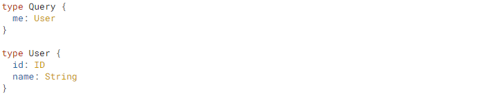

# 2 REVISÃO BIBLIOGRÁFICA

## 2.1   APIS WEB

Segundo Higginbotham [(4)](https://www.oreilly.com/library/view/designing-great-web/9781492048251/) uma API, ou interface de programação de aplicativos, é a especificação de como um software pode interagir com outro. É melhor pensado como um contrato entre o software e os desenvolvedores que o utilizam. Conforme Brenda Jin; Shevat [(2)](https://www.oreilly.com/library/view/designing-web-apis/9781492026914/) uma API é a interface que um programa de software apresenta a outros programas, a humanos e, no caso de APIs da Web, ao mundo por meio da Internet. Ou seja, APIs disponibilizam uma interface que possibilita acessar algum utilitário que necessitamos. As APIs têm tido cada vez um papel mais importante no mundo atual, conforme Brenda Jin; Shevat [(2)](https://www.oreilly.com/library/view/designing-web-apis/9781492026914/) as APIs permitem que as empresas desenvolvam produtos exclusivos rapidamente. Em vez de reinventar a roda, as startups são capazes de diferenciar suas ofertas de produtos enquanto aproveitam as tecnologias existentes e exploram outros ecossistemas. Ainda segundo Brenda Jin; Shevat [(2)](https://www.oreilly.com/library/view/designing-web-apis/9781492026914/) não é nenhum segredo que a web alimenta uma grande parte da inovação de novos produtos e do mercado de tecnologia hoje. Como resultado, as APIs são mais importantes do que nunca na criação de um negócio e existem muitos modelos para incorporá-las a um produto. Em alguns casos, uma API levará a lucro direto e monetização (por meio de modelos de participação nos lucros, taxas de assinatura ou taxas de uso).

## 2.2   GRAPHQL

O GraphQL [(3)](https://graphql.org/) é uma linguagem de consultas para APIs onde o foco está em devolver para o cliente somente o que for solicitado, assim gerando economia de dados e permitindo maior flexibilidade no uso de APIs. Outra vantagem das APIs GraphQL [(3)](https://graphql.org/) é que elas permitem a solicitação de vários recursos em uma única requisição, assim evitando o disparo de diversas requisições para adquirir diferentes recursos. Outro ponto a ser destacado é que o GraphQL [(3)](https://graphql.org/) não está vinculado a nenhuma linguagem ou banco de dados específico, ou seja, para ser utilizado basta a linguagem de programação oferecer suporte. O GraphQL [(3)](https://graphql.org/) foi criado em 2012 e se tornou de código aberto pelo Facebook em 2015. Em 2019, o Facebook e outros criaram a QraphQL Foundation como uma casa neutra e sem fins lucrativos para os ativos do GraphQL [(3)](https://graphql.org/) e a colaboração contínua, é hospedada pela The Linux Foundation. As APIs GraphQL [(3)](https://graphql.org/) são baseadas em types (tipos) e fields (campos), onde a partir deles são implementadas funções para trabalhar com esses dados. Nas requisições o GraphQL [(3)](https://graphql.org/) trabalha com dois tipos de solicitação: as querys (consultas) que servem para retornar dados e as mutations (mutações) que servem para alterar dados. Os dados em uma requisição são retornados no formato JSON. Exemplo de definição de tipo:

Figura 1 – Exemplo de definição de tipo GraphQL.

Exemplo de consulta para o tipo definido:

Figura 2 – Exemplo de consulta GraphQL.

Exemplo de retorno para a consulta acima:

Figura 3 – Exemplo de retorno no formato JSON GraphQL.

Na Figura 1 descreve-se um exemplo de definição de tipo do GraphQL onde se especifica o nome do campo e o tipo do mesmo logo em seguida. Na Figura 2 pode-se ver um exemplo de consulta GraphQL válida para a definição de tipo da Figura 1. Já na figura 3, temos o exemplo de retorno da consulta da Figura 2, já no formato JSON.

## 2.3   TESTE BASEADO EM PROPRIEDADES

Nesta abordagem de teste são especificadas propriedades a serem atendidas por determinado software em teste, este deve obedecer tais especificações. Ou seja, são estabelecidas pré-condições a serem atendidas, e essas condições devem ser atendidas durante a execução dos casos de avaliação de software [(5)](https://research.chalmers.se/publication/232550). Para desenvolvedores Haskell uma biblioteca muito popular é o QuickCheck. Segundo Mista; Russo; Hughes [(7)](https://arxiv.org/abs/1808.01520) o QuickCheck exige que os desenvolvedores especifiquem as propriedades de teste que descrevem o comportamento esperado do software. Então, ele gera um grande número de casos de teste aleatórios e relata aqueles que violam as propriedades de teste especificadas. Ainda conforme Hughes [(5)](https://research.chalmers.se/publication/232550) o QuickCheck sempre testa uma propriedade, gerando casos de teste adequados e verificando se a propriedade é válida em cada caso.

## 2.4   GERAÇÃO DE CÓDIGO ALEATÓRIO

Geração de código aleatório é um procedimento explorado na área de testes, onde segundo Pałka [(9)](https://www.cs.tufts.edu/~nr/cs257/archive/koen-claessen/icsews11astfull-24-palka.pdf) um possível método de geração pode ser obtido lendo as regras de tipo. Com regras pré-estabelecidas podem ser gerados códigos válidos para posterior realização de testes. A geração de código aleatório é muito importante para realização de testes, conforme Pagrut et al. [(8)](https://aircconline.com/ijnlc/V7N3/7318ijnlc01.pdf) a criação de software que é sustentável e escalável precisa de testes. No entanto, o processo de criação manual de casos de teste pode ser tedioso, e é por isso que a automação de teste é interessante. Os benefícios da automação de teste incluem menos trabalho repetitivo, redução de custos e facilidade de manutenção.
